# Plan Fase 2 — Refactor workflows CS Data + CS Seed → MongoDB

> Continuación del plan general en [`PLAN-MIGRACION-MONGO.md`](PLAN-MIGRACION-MONGO.md).
> Fase 1 completada: `PanelCSTickets` (38.144 docs) + `PanelCSCalls` (17.955 docs) + `PanelCSMeta` (2 docs).

## Verificaciones previas

- ✅ Nodo **MongoDB nativo de n8n disponible** — `/credentials/schema/mongoDb` devuelve 200 con schema válido.
- ✅ Conectividad Atlas devqa verificada (acortes con readWrite + createCollection).
- ✅ Cliente del panel (`outputs/cs-panel/index.html`):
  - `/cs-seed` espera `{ gz: <base64 gzip>, count, generated_at }` con tickets en **snake_case**.
  - `/cs-data?since=<unixSeconds>` espera `{ tickets:[...], groups_by_id, agents_by_id, orgs_by_id, synced_until_unix }`.
  - **Implicación**: el shape esperado por el cliente es snake_case. Mongo guarda camelCase. Los nodos n8n hacen el mapeo en respuesta.

## Decisión clave de diseño

**Modelo en Mongo**: camelCase (estándar JS/Mongo, sostenible).
**Mapeo a snake_case**: lo hace n8n en el momento de servir al cliente.
**Refactor del cliente a camelCase**: queda para [[cs-panel-v2]] (no toca este sprint — backwards-compat).

## Plan de creación — Credencial Mongo en n8n

Antes de los workflows, crear la credencial:

| Campo | Valor |
|---|---|
| `name` | `Mongo Atlas devqa - Panel CS` |
| `type` | `mongoDb` |
| `configurationType` | `values` (no connectionString — más legible en UI) |
| `host` | `devqa-mongodb-atlas.26bxl.mongodb.net` |
| `database` | `automatizaciones` |
| `user` | `acortes` |
| `password` | `<MONGO_PASS2>` (inyectado al setup-time desde .env.credentials) |
| `port` | `27017` |
| `tls` | `true` (Atlas siempre TLS) |

Script: `outputs/cs-panel/scripts/setup_mongo_n8n_credential.py` (a crear).

## Workflow nuevo: `CS Data v2 (Mongo)`

### Arquitectura — 2 branches independientes

```mermaid
flowchart TD
    subgraph servirRamo[Branch GET — servir deltas al cliente]
        W1[Webhook GET /cs-data-v2] --> P1[Code: parsear since]
        P1 --> F1[MongoDB Find: PanelCSTickets<br/>updatedAt > sinceDate]
        F1 --> M1[Code: camelCase→snake_case<br/>+ lookups + synced_until_unix]
        M1 --> R1[Respond JSON]
    end
    subgraph syncRamo[Branch Schedule — sync incremental desde Zendesk]
        S1[Schedule cada 5 min] --> CR[MongoDB Find:<br/>PanelCSMeta key=csDataCursor]
        CR --> Q1[Code: construir URL<br/>con start_time del cursor]
        Q1 --> Z1[HTTP Zendesk:<br/>incremental/tickets/cursor.json]
        Z1 --> SL[Code: slim ticket<br/>+ mapear camelCase]
        SL --> U1[MongoDB Bulk Upsert<br/>PanelCSTickets por ticketId]
        U1 --> Z2[HTTP Zendesk:<br/>incremental/ticket_events]
        Z2 --> ME[Code: computar escalamientos<br/>pasoSn1/escSn2/escMo/devol]
        ME --> U2[MongoDB Update<br/>tickets con escalamientos]
        U2 --> UC[MongoDB Upsert<br/>PanelCSMeta cursor nuevo]
    end
```



### Detalle por nodo — Branch GET

| # | Nodo | Tipo | Propósito |
|---|---|---|---|
| 1 | `Webhook /cs-data-v2` | `webhook` | GET, query param `since` (unix seconds), responseMode `responseNode` |
| 2 | `Parsear params` | `code` | Si `since` ausente → usar `now - 1h`. Convierte a Date para query Mongo. |
| 3 | `Find deltas` | `mongoDb` | Operation: `find` · Collection: `PanelCSTickets` · Query: `{ updatedAt: { $gte: ISODate(since) } }` · sort `{ updatedAt: 1 }` |
| 4 | `Map response` | `code` | Convierte camelCase → snake_case en cada doc. Computa `synced_until_unix = max(updatedAt)`. Agrega lookups (groups_by_id, agents_by_id, orgs_by_id — desde colecciones futuras o inline). |
| 5 | `Respond` | `respondToWebhook` | JSON. |

### Detalle por nodo — Branch Schedule

| # | Nodo | Tipo | Propósito |
|---|---|---|---|
| 1 | `Cada 5 min` | `scheduleTrigger` | Interval 5 minutos |
| 2 | `Leer cursor` | `mongoDb` | Operation: `findOne` · Collection: `PanelCSMeta` · Query: `{ key: "csDataCursor" }`. Si no existe, default `start_time = now - 1h` |
| 3 | `Construir URL` | `code` | `https://iconstruye.zendesk.com/api/v2/incremental/tickets/cursor.json?start_time=<cursor>&per_page=1000` |
| 4 | `Fetch Zendesk` | `httpRequest` | GET con credencial `Zendesk Prod`. Paginación cursor (no offset). |
| 5 | `Slim` | `code` | Lógica idéntica a `slim_ticket()` de `carga_inicial.py` + mapeo a camelCase. |
| 6 | `Upsert tickets` | `mongoDb` | Operation: `update` (bulk) con upsert · filter `{ ticketId: $$ITEM.ticketId }` · update `{ $set: $$ITEM }`. n8n hace bulk automáticamente con N items input. |
| 7 | `Fetch events` | `httpRequest` | GET `incremental/ticket_events.json?start_time=<eventsCursor>` |
| 8 | `Compute escalations` | `code` | Recorre events, identifica transitions de SN1/SN2/MO, devuelve `{ ticketId, pasoSn1, escSn2, escMo, devol }`. |
| 9 | `Update escalations` | `mongoDb` | Update por ticketId con $set de los 4 campos. |
| 10 | `Save cursors` | `mongoDb` | Upsert PanelCSMeta `{ key: "csDataCursor", value: newCursor, updatedAt: now }` y `{ key: "csDataEventsCursor", value: newEventsCursor }`. |

### Settings del workflow

```json
{
  "executionOrder": "v1",
  "saveExecutionProgress": false,
  "saveDataErrorExecution": "all",
  "saveDataSuccessExecution": "none",   // ← clave: NO guardar payloads exitosos
  "errorWorkflow": "o89xKbjT6mKkjAmN",
  "executionTimeout": 180
}
```

> **`saveDataSuccessExecution: "none"`** es lo que evita la repetición del incidente. Aún con auto-cleanup 2 días de devops, no acumulamos historial innecesario.

## Migración del cursor — paso crítico

> Si activamos v2 sin migrar el cursor, v2 arranca desde `now - 1h` y pierde los tickets actualizados entre el último run de v1 y ahora (~días, porque v1 está inactivo desde el incidente).

Pasos:
1. Inspeccionar staticData del workflow v1 (`akkbfUdsiXEg57LK`) vía API n8n → leer cursor actual.
2. Insertar `{ key: "csDataCursor", value: cursorV1 }` en `PanelCSMeta`.
3. Lo mismo con `csDataEventsCursor`.
4. Recién activar v2.

Script: `outputs/cs-panel/scripts/migrate_cursor_to_mongo.py` (a crear).

## Pruebas antes de activar v2

> Plan de validación gradual — NO activar v2 hasta pasar todas:

1. **Setup credencial Mongo en n8n** + verificar conexión con un workflow de prueba simple (`SELECT count(*) FROM PanelCSTickets`).
2. **Crear workflow v2 desactivado** vía API.
3. **Trigger manual del Branch Schedule** desde UI n8n (Execute Workflow). Verificar en consola Mongo que se hicieron upserts.
4. **Trigger manual del Branch GET** vía `curl /webhook/cs-data-v2?since=...`. Validar shape del JSON devuelto contra lo que espera el cliente.
5. **Probar con el cliente real** en modo "no productivo":
   - Comprobar que `j.tickets` viene con todos los campos en snake_case.
   - Comprobar que `j.synced_until_unix` se respeta como cursor del cliente.
6. **Si todo OK**: desactivar v1, activar v2, smoke test con el panel productivo (Ctrl+F5 del navegador).

## Rollback plan

Si v2 rompe después de activar:
1. Desactivar v2 (1 click UI).
2. Reactivar v1 — está congelado con la última staticData válida.
3. Con auto-cleanup 2 días de devops, v1 ya no satura n8n (solo guarda 2 días de historial).
4. Iterar v2 offline hasta resolver.

## Aircall Data v2 — paralelo o secuencial?

Mismo patrón pero distinto endpoint Aircall API. Volumen más chico, menos riesgo.

**Sugerencia**: dejarlo para Fase 2.2 después de validar que CS Data v2 funciona, para no abrir 2 frentes de prueba simultáneos.

## Workflow `CS Seed v2 (Mongo)` — más simple

Reemplaza el workflow actual de CS Seed. 2 nodos solamente:

```
Webhook GET /cs-seed-v2
  ↓
MongoDB Find: PanelCSTickets.find({}, projection) (todos los tickets)
  ↓
Code: snake_case + gzip + base64 → { gz, count, generated_at }
  ↓
Respond JSON
```

**Concesión de performance**: 38k tickets serializados + gzip on-the-fly puede tardar 5-10s. Tolerable porque solo se llama 1 vez al cargar el panel.

**Optimización futura**: cachear el seed gzipped en `PanelCSMeta` como blob binario refrescado por cron diario, y servirlo precomputado. Para Fase 3 si las latencias molestan.

## Resumen de archivos a crear

| Archivo | Propósito | Estado |
|---|---|---|
| `scripts/setup_mongo_n8n_credential.py` | Crear credencial mongoDb en n8n via API | ⏳ |
| `scripts/migrate_cursor_to_mongo.py` | Migrar cursor actual de v1 a PanelCSMeta | ⏳ |
| `scripts/setup_cs_data_v2_workflow.py` | Crear workflow CS Data v2 desactivado | ⏳ |
| `scripts/setup_cs_seed_v2_workflow.py` | Crear workflow CS Seed v2 desactivado | ⏳ |

## Costos en tiempo (estimados)

| Paso | Tiempo |
|---|---|
| Crear credencial Mongo en n8n | 5 min |
| Migrar cursor | 5 min |
| Crear workflow CS Data v2 inactivo (via script) | 30 min |
| Probar Branch Schedule manual | 15 min |
| Probar Branch GET con curl | 10 min |
| Validar con cliente del panel | 15 min |
| Crear + probar CS Seed v2 | 30 min |
| Swap v1→v2 + smoke test | 10 min |
| **Total estimado** | **~2 horas** |

## Pido tu aprobación de

1. **Arquitectura**: Branch GET + Branch Schedule en un mismo workflow (vs 2 workflows separados). El "todo en uno" simplifica gestión.
2. **Mapeo camelCase ↔ snake_case en n8n**: vs migrar el cliente a camelCase (lo dejamos para `cs-panel-v2` futuro).
3. **Endpoint nuevo `/cs-data-v2`** vs reemplazar `/cs-data`: yo recomiendo crear v2 paralelo, validar, después swap (cliente cambia URL = 1 línea).
4. **Mismo enfoque para CS Seed**: `/cs-seed-v2` paralelo, swap al final.
5. **Aircall Data** queda para Fase 2.2 (no se toca ahora).
