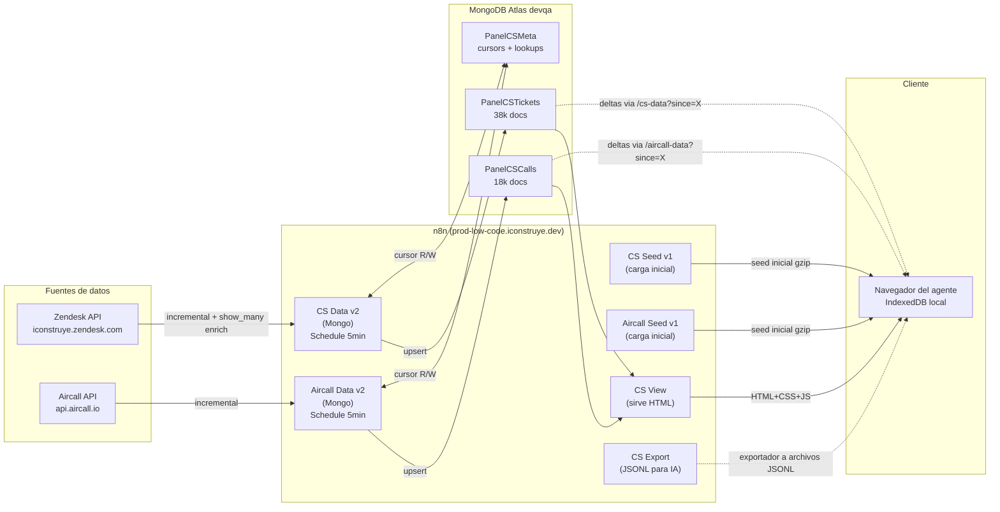

# Panel KPIs Customer Service

> Panel interno de iConstruye para Customer Service. Sirve métricas operativas en tiempo casi-real desde Zendesk + Aircall (+ futuro Wotnot). Cero dependencia de Power BI: web app pura servida desde n8n, datos en MongoDB Atlas.

## Contexto

El equipo de Customer Service (SN1, SN2, SACOT, Automatizaciones, Mantención Operativa) necesita visibilidad operativa del estado del soporte: tickets activos, SLA en riesgo, tiempos de primera respuesta, distribución de canales, performance por agente, métricas de llamadas Aircall, escalamientos cross-equipo.

Hasta 2026-Q1 esto vivía en Power BI con refresh manual diario, lo que generaba 3 problemas:
- Datos rezagados (refresh a las 06:00 chile no servía durante la mañana).
- Nadie del CS team podía ajustar la visualización sin pasar por Datos/BI.
- Imposible escalar a vistas live tipo wallboard.

El proyecto reemplaza Power BI por una webapp interna ejecutándose en n8n, con sync incremental cada 5 min desde Zendesk + Aircall, datos persistidos en MongoDB Atlas, y rendering en el cliente vía IndexedDB local.

## Estado actual (2026-05-28)

- **Producción**: panel sirviendo a CS team en `prod-low-code.iconstruye.dev/webhook/cs-view`.
- **Datos**: 38.144 tickets + 17.955 calls Aircall en MongoDB Atlas devqa (BD `automatizaciones`).
- **Sync**: incremental cada 5 min (CS Data v2 + Aircall Data v2 en n8n).
- **Cliente**: HTML+CSS+JS embebido en workflow `CS View`, sin distribución de archivo a usuarios.
- **Cero hardcoding**: credenciales en n8n vault.

## Arquitectura de alto nivel

## Métricas que entrega el panel

| Métrica | Fuente | Granularidad |
|---|---|---|
| Tickets activos por equipo (SN1/SN2/SACOT/MO) | Zendesk · status + group_id | Live |
| First Reply Time (FRT) por nivel/canal | Zendesk metric_sets.reply_time_in_minutes | Vida real |
| SLAs vencidos por equipo | Zendesk policy_metrics.breach_at | Live |
| Top FRT (peor tiempo respuesta) | Mongo PanelCSTickets ordenado por frtMin | Top 20 |
| Top SLA (mayor antigüedad sin respuesta) | Mongo PanelCSTickets ordenado por edad | Top 20 |
| Distribución por canal (Teléfono / Chat / Correo) | Zendesk via.channel + tags | % share |
| CSAT (satisfacción) | Zendesk satisfaction_rating.score | % por agente |
| Calls Aircall por agente / por número | Aircall API | Live |
| Tasa de respondidas vs perdidas (Aircall) | Aircall call.status | Live |
| Escalamientos cross-team (pasoSn1, escSn2, escMo, devol) | ticket_events de Zendesk (Fase 3b pendiente) | Histórico |
| Exportador a JSONL para análisis IA | n8n CS Export | On-demand |

## Componentes técnicos

| Componente | Tecnología | Repo / Ubicación |
|---|---|---|
| Backend de orquestación | n8n self-hosted | `prod-low-code.iconstruye.dev` |
| Base de datos | MongoDB Atlas (devqa cluster) | BD `automatizaciones` |
| Cliente del panel | HTML/CSS/JS vanilla con IndexedDB | Workflow `CS View` en n8n |
| Scripts de operación | Python 3.13 + pymongo + requests | (repo único pendiente) |
| Carga inicial | `carga_inicial.py` + `populate_mongo_from_seed.py` | (repo único pendiente) |
| Setup workflows | `setup_v2_workflows.py` | (repo único pendiente) |
| Snapshot/rollback workflows | `snapshot_workflow.py` | (repo único pendiente) |

## Decisiones clave tomadas

- **MongoDB Atlas en lugar de Postgres n8n**: tras el incidente 28-may del workflow CS Data v1 que acumuló 69 GB en `execution_data` por staticData mutante, se migró a Mongo como persistencia separada del runtime de n8n.
- **Cliente del panel sin cambios entre v1 y v2**: paths `/webhook/cs-data` y `/webhook/aircall-data` se mantienen, shape de response idéntico. Cero distribución de HTML nuevo a usuarios.
- **camelCase en Mongo, snake_case al servir al cliente**: el branch GET de los workflows hace el mapeo. Aísla schema de transporte.
- **Cursors en `PanelCSMeta`**: no en `staticData` del workflow (causa del incidente). `PanelCSMeta` es colección separada con docs `{key, value, updatedAt, notes}`.
- **`saveDataSuccessExecution: 'none'`** en workflows v2 — evita el bloating de Postgres n8n. Errores sí se guardan (`saveDataErrorExecution: 'all'`).
- **Credenciales en n8n vault**: cero token en código, cero token en repo. Workflows referencian credenciales por ID + tipo.

## Equipo

- **Owner**: Alvaro Cortés (@pelu) · Automatizaciones (CS) · iConstruye.
- **Jefatura**: Aldo Carvajal (Líder Automatizaciones).
- **DevOps n8n (infra)**: Marcelo Letelier (memoria, BD, restarts del worker).
- **Cliente interno**: equipo CS completo (SN1, SN2, SACOT, Mantención Operativa, líderes).

## Ciclo de actualización

Cada vez que se trabaje en este proyecto:
1. Actualizar el repo único (commits en español, autoría del usuario).
2. Actualizar la doc técnica en Notion `Panel-CS-versi-n-n8n`.
3. Actualizar la estructura 1-7 de este proyecto en Notion si cambian alcance/objetivos.
4. Actualizar el Description en Linear (este archivo) si hay cambios estructurales.
5. Mover ToDos a "Done" en Linear y abrir nuevas issues por sub-tarea.

## Referencias

- Notion técnico: `Panel-CS-versi-n-n8n` (id `36e12e126339802395c7f0f5ab63f5cd`)
- Notion proyecto: `Panel-KPIs-Customer-Service` (id `36e12e1263398036a3ace107a3fd7c54`)
- Linear: `panel-kpis-customer-service-982e63a98ceb`
