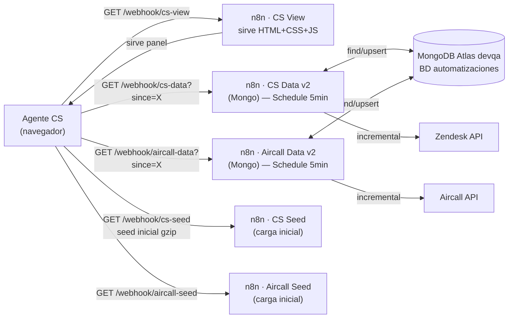
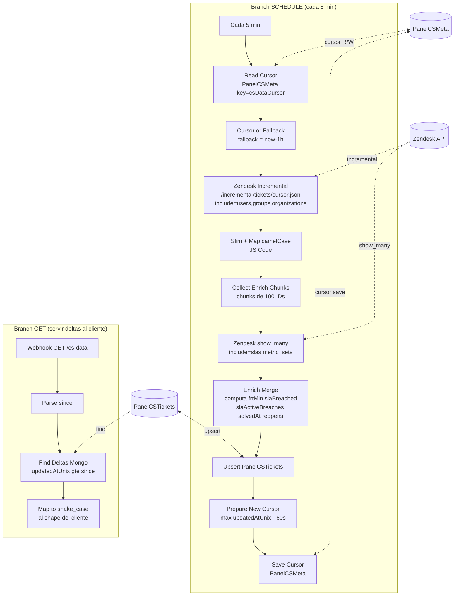
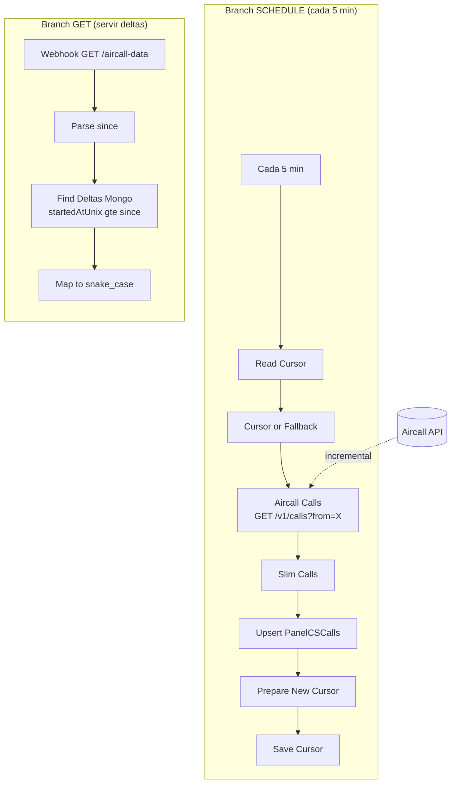
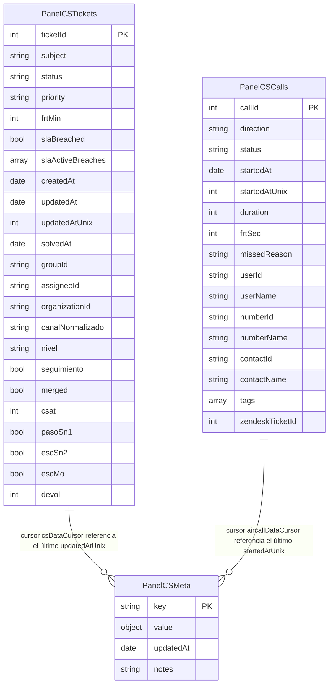
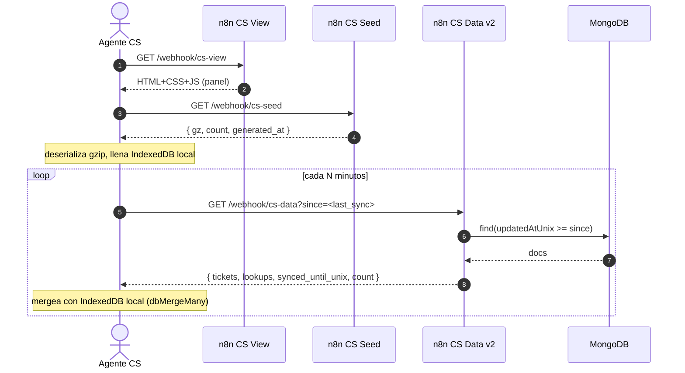

# Panel CS — versión n8n · Documentación técnica

> Documento maestro técnico del Panel CS implementado sobre n8n + MongoDB Atlas. Toda la información operativa, arquitectónica y de mantenimiento vive acá. Actualizar cada vez que se trabaje en el proyecto.

**Última actualización**: 2026-05-28 · Alvaro Cortés

---

## 1. Visión rápida

El Panel CS es una **webapp interna** servida desde n8n que muestra métricas operativas de Customer Service en tiempo casi-real. No usa Power BI, no requiere refresh manual. El cliente (navegador) consume un seed gzip inicial + deltas cada cierto tiempo y mantiene un cache local en IndexedDB.



---

## 2. Stack tecnológico

| Capa | Tecnología | Notas |
|---|---|---|
| Orquestación | **n8n** self-hosted (`prod-low-code.iconstruye.dev`) | Versión actual: ver en UI. Devops: Marcelo Letelier. |
| Persistencia | **MongoDB Atlas** devqa cluster (`devqa-mongodb-atlas.26bxl.mongodb.net`) | BD `automatizaciones`. Acceso público (no requiere VPN). |
| Fuente Zendesk | **Zendesk REST API** | `iconstruye.zendesk.com/api/v2`. Auth basic con `user/token`. |
| Fuente Aircall | **Aircall REST API** | `api.aircall.io/v1`. Auth basic con `api_id:api_token`. |
| Cliente | HTML5 + vanilla JS + IndexedDB | Sin frameworks. Mermaid client-side para flowcharts. |
| Scripts operación | Python 3.13 + `pymongo`, `requests`, `urllib` | Carga inicial, populate Mongo, setup workflows, snapshots. |

---

## 3. Workflows en n8n

### 3.1 Inventario operativo

| Nombre | ID | Path webhook | Schedule | Estado |
|---|---|---|---|---|
| **CS View** | `qOIldhWyoeGMUa2p` | `/cs-view` | — | Activo |
| **CS Seed** | `SXt8GRp5zjKKNfh6` | `/cs-seed` (GET) + `/cs-seed` (POST) | — | Activo |
| **CS Data v2 (Mongo)** | `eOarJPeIeUPI45de` | `/cs-data?since=X` | **5 min** | Activo |
| **Aircall Seed** | `dOwtLmTCONRJ48Ir` | `/aircall-seed` | — | Activo |
| **Aircall Data v2 (Mongo)** | `HUE2XQ25uO5BuDw6` | `/aircall-data?since=X` | **5 min** | Activo |
| **CS Export** | `VDRQnxqBumKPfiyC` | `/cs-export` | — | Activo |
| **CS DTE Health** | `p40WEmG8nXh1HhSD` | (interno) | 24h | Activo |

### 3.2 Workflows deprecated (off, pendientes de eliminar)

`akkbfUdsiXEg57LK` (CS Data v1 — causante del incidente 69 GB), `xLoZ7zAJNaG5zZ64` (Aircall Data v1), `wyFkXiYJmwB9ARFg` (Aircall Seed v2 deprecated), `l4ycDRei3Toq9Y6z` (CS Seed v2 deprecated), `kQmPeDgXA27mKQPj` (CS View viejo con FK violation), `KCAYUi1rHWo5hXiT` (CS Queue Live VP), `JmiBb6cMLHSvxZ8l` (Dashboard Tickets CS VP), `BI8zQMm49BUXf0JB` (CS Auth), `ARQJQmYpEl6Zd3sn` (CS Email), `o89xKbjT6mKkjAmN` (CS Errores).

### 3.3 Flujo del workflow CS Data v2 (corazón del sync)



> El nodo "Collect Enrich Chunks" + "Zendesk show_many" + "Enrich Merge" es el **patch BRECHA 1** que agrega métricas correctas a tickets nuevos/actualizados. Sin esta cadena, los tickets actualizados llegan a Mongo con `frtMin/slaBreached/slaActiveBreaches/solvedAt/reopens` en `null`.

### 3.4 Flujo del workflow Aircall Data v2



### 3.5 Credenciales en n8n vault

> Cero token hardcodeado. Workflows referencian credenciales por ID + tipo.

| Credencial | ID | Tipo | Usada en |
|---|---|---|---|
| Zendesk Prod | `68yjtB8sha7fDhHj` | `zendeskApi` (predefined) | CS Data v2, scripts Python |
| Aircall Basic - iconstruye | `621TBwMU0NWdnKNM` | `httpBasicAuth` (generic) | Aircall Data v2 |
| Mongo Atlas devqa - Panel CS | `${MONGO_N8N_CRED_ID}` | `mongoDb` | CS Data v2, Aircall Data v2 |

---

## 4. Estructura de datos en MongoDB Atlas

**Cluster**: `devqa-mongodb-atlas.26bxl.mongodb.net` · **BD**: `automatizaciones`

### 4.1 Colecciones



### 4.2 Schema PanelCSTickets — campos clave

| Campo Mongo (camelCase) | Tipo | Origen | Notas |
|---|---|---|---|
| `ticketId` | int | Zendesk `ticket.id` | clave primaria |
| `subject`, `status`, `priority`, `type` | string | Zendesk ticket raw | |
| `createdAt`, `updatedAt` | Date | Zendesk ISO → Date | |
| `createdAtUnix`, `updatedAtUnix` | int | derivado | índice usado para queries delta |
| `solvedAt`, `closedAt` | Date | enrich (`metric_sets.solved_at`) | null en sync sin enrich |
| `frtMin` | int | enrich (`metric_sets.reply_time_in_minutes.calendar`) | null sin enrich |
| `reopens` | int | enrich (`metric_sets.reopens`) | null sin enrich |
| `groupId`, `assigneeId`, `organizationId` | string | Zendesk ticket | string para evitar overflow JS |
| `slaBreached` | bool | enrich (computado contra `policy_metrics.breach_at`) | true si algún SLA activo vencido |
| `slaActiveBreaches` | array | enrich (filtrado `stage=active\|paused`) | `[{metric, stage, breachAt}]` |
| `nivel`, `seguimiento`, `merged`, `csat` | varios | custom fields Zendesk | |
| `lineaNegocio`, `categoria`, `producto`, `subproducto` | string | custom fields Zendesk | |
| `pasoSn1`, `escSn2`, `escMo`, `devol` | bool/int | ticket_events (Fase 3b — pendiente) | null en deltas hasta BRECHA 3 |
| `viaChannel`, `canalNormalizado` | string | Zendesk via | normalizado vs Power BI |
| `chatSubtype` | string | tags + via | offline / sodexo / sn1 / portal_proveedores / general |
| `aircallCallId` | int | custom field 16444628344091 | cross-link Aircall ↔ Zendesk |
| `_syncedAt`, `_syncSource` | Date / string | trazabilidad | |

### 4.3 Schema PanelCSMeta — cursors y lookups

| `key` | `value` | Owner | Notas |
|---|---|---|---|
| `csDataCursor` | int (unix seconds) | CS Data v2 | max `updatedAtUnix` del último batch - 60s overlap |
| `aircallDataCursor` | int (unix seconds) | Aircall Data v2 | max `startedAtUnix` del último batch - 60s overlap |
| `csDataEventsCursor` | int | (Fase 3b pendiente) | cursor para ticket_events |
| `lookupsUsers`, `lookupsGroups`, `lookupsOrgs` | object | (BRECHA 2 pendiente) | mapeo id → nombre para deltas |
| `lastFullSync` | object | `populate_mongo_from_seed.py` | total + source + seedGeneratedAt |

### 4.4 Índices recomendados

```javascript
// PanelCSTickets
db.PanelCSTickets.createIndex({ ticketId: 1 }, { unique: true })
db.PanelCSTickets.createIndex({ updatedAtUnix: 1 })  // queries de delta
db.PanelCSTickets.createIndex({ status: 1, groupId: 1 })  // dashboards por equipo
db.PanelCSTickets.createIndex({ assigneeId: 1 })

// PanelCSCalls
db.PanelCSCalls.createIndex({ callId: 1 }, { unique: true })
db.PanelCSCalls.createIndex({ startedAtUnix: 1 })

// PanelCSMeta
db.PanelCSMeta.createIndex({ key: 1 }, { unique: true })
```

---

## 5. Cómo se pobla la data

### 5.1 Carga inicial (manual, one-shot)

> Usar al inicio del proyecto o cuando hay que cerrar un gap grande del incremental.

```bash
# Desde el repo workspace
set -a; source .env.credentials; set +a
python outputs/cs-panel/scripts/carga_inicial.py --desde 2026-01-01
python outputs/cs-panel/scripts/populate_mongo_from_seed.py
```

`carga_inicial.py` hace:
1. Incremental Zendesk completo desde `--desde` (default `2026-01-01`).
2. Search del queue activo (Search API) para agregar tickets viejos abiertos.
3. Enrich por show_many: 5k activos + ~33k cerrados, batches de 100, traen `slas` + `metric_sets`.
4. Computa `frt_min`, `sla_breached`, `sla_active_breaches`, `solved_at`, `reopens`.
5. Computa escalamientos `paso_sn1`, `esc_sn2`, `esc_mo`, `devol` desde ticket_events.
6. Publica el blob gzip+base64 al webhook `POST /cs-seed` con token.

`populate_mongo_from_seed.py` baja el seed servido en `GET /cs-seed`, lo deserializa, mapea snake_case → camelCase, y hace bulk-upsert (`updateOne` por `ticketId` con `upsert=true`) en batches de 500.

### 5.2 Sync incremental (continuo, automático)

CS Data v2 corre cada 5 min:
1. Lee `csDataCursor` de PanelCSMeta (fallback = now-1h si no existe).
2. `GET /api/v2/incremental/tickets/cursor.json?start_time=X&include=users,groups,organizations&per_page=1000` — pagina hasta `end_of_stream` o 5 páginas máx.
3. `Slim + Map camelCase` — mapea cada ticket Zendesk a camelCase Mongo.
4. **(BRECHA 1)** `Collect Enrich Chunks` → `Zendesk show_many` → `Enrich Merge` — agrega FRT/SLA.
5. `Upsert PanelCSTickets` — upsert por `ticketId`.
6. `Prepare New Cursor` — `max(updatedAtUnix) - 60s overlap`.
7. `Save Cursor` — escribe `csDataCursor` en PanelCSMeta.

Aircall Data v2 sigue el mismo patrón pero contra Aircall API (`/v1/calls?from=X`).

### 5.3 Flujo de datos del cliente



---

## 6. Scripts de operación

Todos en `outputs/cs-panel/scripts/` (workspace ICClaude). En el futuro vivirán en el repo único de Panel CS.

| Script | Propósito | Frecuencia |
|---|---|---|
| `carga_inicial.py` | Carga masiva inicial + enrich + publica seed | One-shot o cuando hay gap grande |
| `populate_mongo_from_seed.py` | Sincroniza Mongo PanelCSTickets desde el seed n8n | Post `carga_inicial.py` |
| `populate_mongo_calls.py` | Análogo para PanelCSCalls | Post Aircall carga inicial |
| `carga_inicial_aircall.py` | Carga masiva de calls Aircall | One-shot |
| `setup_v2_workflows.py` | Idempotent: crea/actualiza CS Data v2 + Aircall Data v2 vía API n8n | Cada cambio estructural |
| `setup_cs_seed.py` | Idempotent: workflow CS Seed | Una vez |
| `setup_aircall_seed.py` | Idempotent: workflow Aircall Seed | Una vez |
| `setup_cs_export.py` | Idempotent: workflow CS Export | Una vez |
| `snapshot_workflow.py` | GET workflow → archivo JSON (rollback) | Antes de cada cambio |
| `list_workflows.py` | Lista workflows con estado active/off | Diagnóstico |
| `deploy_cs_view.py` | Despliega CSS/JS del panel al workflow CS View | Cada cambio en cliente |
| `migrate_cursors_to_mongo.py` | One-shot: migró cursors de staticData → Mongo | Solo en migración inicial |

### 6.1 Patrón whitelist para PUT workflow

`deploy_cs_view.py:97-108` y `setup_v2_workflows.py:916` aplican whitelist a `settings` antes del PUT, porque n8n API rechaza `availableInMCP` y `binaryMode` con 400 "must NOT have additional properties":

```python
SETTINGS_WHITELIST = {
    "executionOrder", "saveManualExecutions", "saveExecutionProgress",
    "saveDataErrorExecution", "saveDataSuccessExecution",
    "executionTimeout", "timezone", "errorWorkflow",
}
settings = {k: v for k, v in raw_settings.items() if k in SETTINGS_WHITELIST}
payload = {"name": ..., "nodes": ..., "connections": ..., "settings": settings}
api("PUT", f"/workflows/{wid}", payload)
```

Importante: el PUT **no incluye `active`** en el body — el server preserva el estado activo del workflow.

---

## 7. Lecciones aprendidas

### 7.1 Incidente 28-may: bloating 69 GB en Postgres n8n

**Síntoma**: el host de n8n se quedó sin disco. Marcelo (devops) notificó por Slack.

**Causa raíz**: el workflow `CS Data v1` usaba `$getWorkflowStaticData('global')` en el nodo `Actualizar Caché` para acumular el dataset completo (38k tickets) cada 5 min. n8n serializa el staticData a la tabla `execution_data` de Postgres en cada ejecución. Como el staticData crecía con cada update + el workflow tiene `saveDataSuccessExecution: 'all'` (default), Postgres terminó acumulando 69 GB.

**Parche temporal (devops)**:
- Auto-cleanup de `execution_data` a 2 días.
- Desactivación de los workflows del Panel CS hasta resolver.

**Resolución estructural**:
- Migración a MongoDB Atlas como persistencia separada.
- Cursors en `PanelCSMeta` (colección dedicada, no staticData).
- `saveDataSuccessExecution: 'none'` en workflows v2 (errores sí se guardan).
- `executionTimeout: 240` segundos por workflow.

**Lecciones**:
- Nunca usar `staticData` para datasets que crecen — solo para configs estáticas o cursors pequeños.
- Default de n8n `saveDataSuccessExecution: 'all'` es peligroso para workflows de alto volumen.
- Tener una colección/tabla dedicada a cursors es trivial y elimina el riesgo.

### 7.2 PUT n8n rechaza propiedades adicionales en `settings`

`availableInMCP` y `binaryMode` vienen en el GET pero el PUT los rechaza con 400. El server los re-inyecta con default automáticamente. Whitelist obligatorio.

### 7.3 Node API n8n no copia workflows

Validado 2026-05-27: el endpoint `/workflows/{id}/copy` no existe. Para clonar un workflow corrupto hay que:
1. Duplicar en UI (UI tiene "Duplicate"), o
2. GET completo + POST como nuevo nombre.

### 7.4 `active` no se cambia vía PUT

PUT `/workflows/{id}` con `active: true/false` en el body no afecta el estado. Para activar/desactivar hay endpoints separados: `POST /workflows/{id}/activate` y `POST /workflows/{id}/deactivate`.

### 7.5 Bug n8n #21614 — "Version not found" al activar via API

Workaround: activar siempre desde la UI después del PUT. Confirmado 2026-05-27 con el workflow `qOIldhWyoeGMUa2p`.

### 7.6 Code node sandbox bloquea módulos

Bloqueados en el sandbox JS de n8n Code node:
- `zlib`
- `Blob`
- `CompressionStream`
- `httpRequestWithAuthentication`

Para gzip se debe usar el HTTP Request node con body raw + Content-Encoding, o procesar fuera de n8n.

### 7.7 MongoDB Atlas + n8n: no interpreta `{$date}`

n8n MongoDB node **no** interpreta Extended JSON `{$date: ISO}` en queries. Solución: usar campos `*Unix` (int) para comparaciones temporales:

```javascript
// MAL
query: { updatedAt: { $gte: { $date: "2026-01-01T00:00:00Z" } } }

// BIEN
query: { updatedAtUnix: { $gte: 1735689600 } }
```

Por eso PanelCSTickets duplica `createdAt` (Date) y `createdAtUnix` (int).

### 7.8 HTTP Request node: predefined vs generic credentials

| Servicio | Tipo credencial | Config en HTTP node |
|---|---|---|
| Zendesk (servicio reconocido) | `predefinedCredentialType` + `nodeCredentialType: zendeskApi` | n8n inyecta auth automáticamente |
| Aircall (no reconocido) | `genericCredentialType` + `genericAuthType: httpBasicAuth` | Usa credencial Basic genérica |

Confundirse rompe el sync silencioso.

### 7.9 Devops infra vs admin workflows

- **Marcelo Letelier** = devops infra n8n (memoria, BD, restarts, espacio en disco). Es a quien se le pide intervención cuando n8n cae o se llena el disco.
- **Aldo Carvajal** = admin workflows (deploy, credentials, configuración). Es jefatura directa del proyecto.

NO son intercambiables. Confundirlos genera fricción.

### 7.10 Re-versiones silenciosas de entregables

Histórico: en una sesión previa se generó v2 de un entregable mientras el usuario cargaba v1, sin avisar. El usuario terminó con la versión vieja en producción. Regla operativa nueva: declarar entregables como cerrados, esperar antes de iterar. (Aplica a entregables al cliente, no a desarrollo interno del Panel CS).

---

## 8. Endpoints expuestos

| Método | Path | Servido por | Propósito |
|---|---|---|---|
| GET | `/webhook/cs-view` | CS View | Sirve el HTML+CSS+JS del panel |
| GET | `/webhook/cs-seed` | CS Seed | Sirve el seed gzip+base64 |
| POST | `/webhook/cs-seed` | CS Seed | Recibe seed nuevo (carga_inicial.py) — requiere token |
| GET | `/webhook/cs-data?since=<unix>` | CS Data v2 | Sirve tickets actualizados desde `since` |
| GET | `/webhook/aircall-seed` | Aircall Seed | Sirve seed Aircall |
| GET | `/webhook/aircall-data?since=<unix>` | Aircall Data v2 | Sirve calls actualizadas desde `since` |
| POST | `/webhook/cs-export` | CS Export | Genera export JSONL para análisis IA |

---

## 9. Variables de entorno requeridas

> Ver `.env.credentials` en el workspace (trackeado en git por diseño, repo privado).

| Variable | Sistema | Notas |
|---|---|---|
| `ZENDESK_USER` | Zendesk | usuario de la cuenta API |
| `ZENDESK_TOKEN` | Zendesk | token API |
| `ZENDESK_BASE_URL` | Zendesk | `https://iconstruye.zendesk.com` |
| `AIRCALL_API_ID` | Aircall | api_id |
| `AIRCALL_API_TOKEN` | Aircall | api_token |
| `N8N_API_URL` | n8n | `https://prod-low-code.iconstruye.dev/api/v1` |
| `N8N_API_KEY` | n8n | API key personal |
| `CS_SEED_TOKEN` | n8n CS Seed | token compartido para POST al webhook /cs-seed |
| `MONGO_HOST2` | Mongo Atlas | hostname devqa cluster |
| `MONGO_USER2` | Mongo Atlas | usuario lectura/escritura BD `automatizaciones` |
| `MONGO_PASS2` | Mongo Atlas | password |
| `MONGO_N8N_CRED_ID` | n8n vault | ID interno de la credencial Mongo Atlas en n8n |

---

## 10. Brechas pendientes vs versión v1

Detalle en `outputs/cs-panel/TODO-PARIDAD-V1-MONGO.md`. Resumen:

| Brecha | Estado | Impacto |
|---|---|---|
| 1 — Enrich FRT/SLA en Schedule | 🟡 Pre-armada · pendiente aplicar | Tickets nuevos sin métricas correctas |
| 2 — Lookups en deltas | 🔴 Pendiente | Tickets con assignee nuevo muestran "Agente {id}" |
| 3 — Events/escalamientos | 🔴 Pendiente | Escaladas post-seed no se reflejan |
| 5 — Cleanup backlog | 🟡 En curso (Plan B) | Tickets actualizados durante gap no en Mongo |
| 6 — Cleanup workflows deprecated | 🔴 Pendiente | Inventario sucio en n8n |

---

## 11. Cómo retomar este proyecto

1. Leer este documento + el Description en Linear.
2. Mirar el ToDos+Milestones más reciente en Linear.
3. Ver el estado actual de los workflows con `python outputs/cs-panel/scripts/list_workflows.py`.
4. Si hay material previo en `outputs/cs-panel/`, leerlo todo antes de empezar.
5. Cargar `.env.credentials` antes de cualquier script (`set -a; source .env.credentials; set +a`).
6. Snapshot del workflow antes de tocarlo (`python outputs/cs-panel/scripts/snapshot_workflow.py "nombre"`).
7. Aplicar cambios idempotentes (`setup_v2_workflows.py`, `deploy_cs_view.py`).
8. Commit en español. Sin Co-Authored-By Claude (autoría del usuario).
9. Actualizar este documento si cambia algo estructural.

---

## 12. Roadmap forward (después de paridad 100%)

- **Wotnot (chat) como stream propio** — actualmente representado en columna "Chat" pero sin sync incremental dedicado.
- **cs-panel-v2** — migración tecnológica futura. HU 1: vista global "Todos" con KPIs cross-canal etiquetados por fuente, mirada ejecutiva (VP/líderes).
- **KPIs derivados con líderes CS** — NPS, tiempo medio de cierre, distribución de complejidad, etc.
- **Lazy load del seed** — abrir el panel sin descargar los 38k tickets de una.
- **Auth real del panel** — actualmente expone vía webhook sin auth.

---

*Documento mantenido por Alvaro Cortés (@pelu). Última actualización por turno de trabajo en SES-20260528-1810.*
