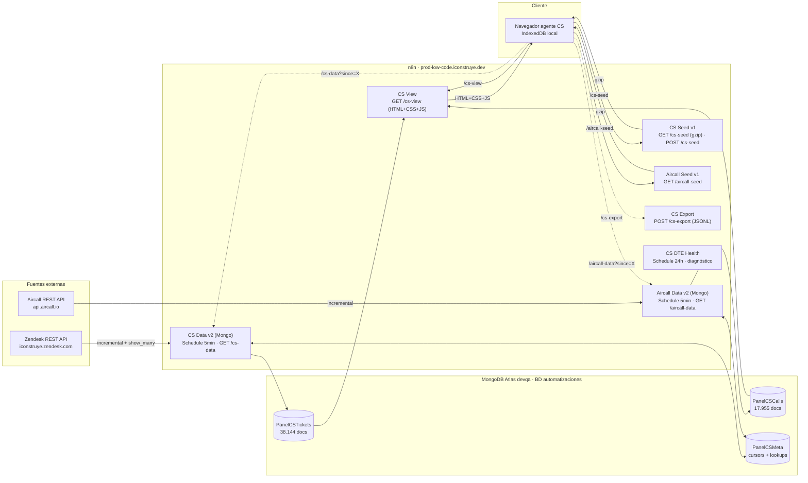
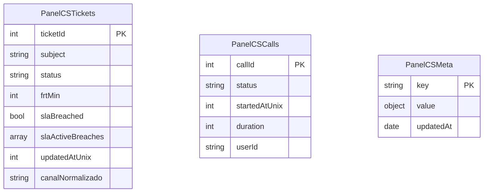
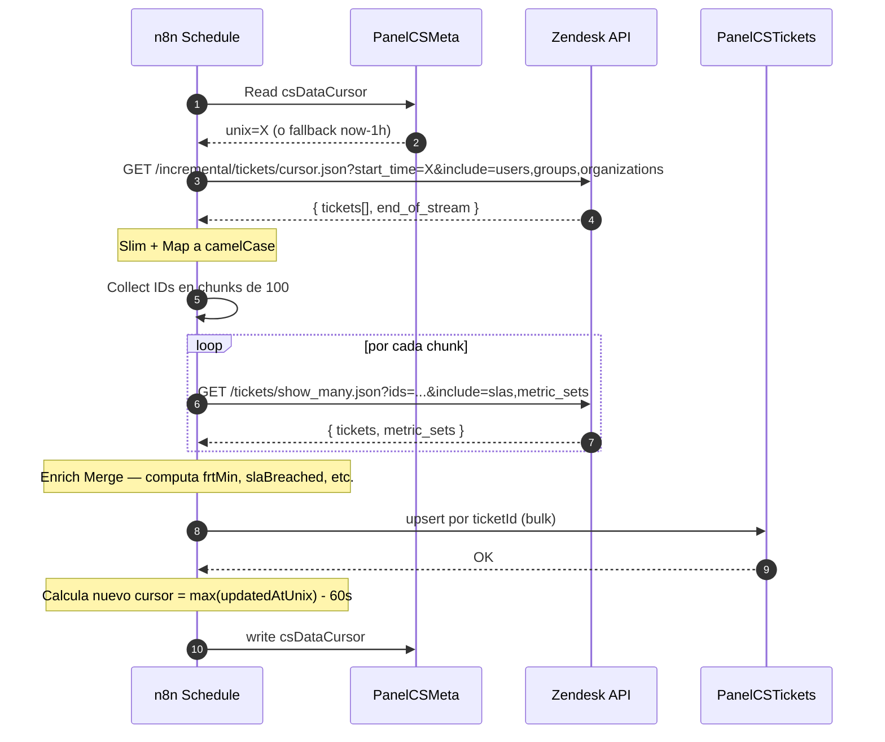
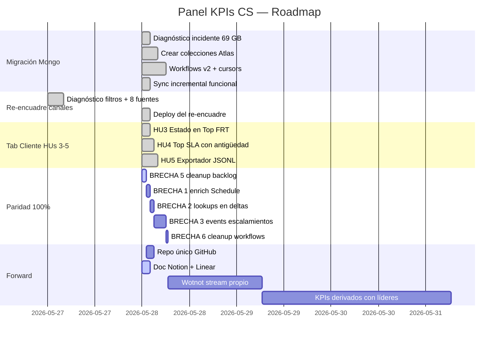

# Panel KPIs Customer Service — estructura 1-7 del proyecto

> Contenido para rellenar los puntos 1 a 7 de la página Notion `Panel-KPIs-Customer-Service` (id `36e12e1263398036a3ace107a3fd7c54`). Cada sección está pensada para copiar/pegar directamente.

**Última actualización**: 2026-05-28 · Alvaro Cortés

---

## 1. Contexto y motivación

El equipo de Customer Service de iConstruye (SN1, SN2, SACOT, Automatizaciones, Mantención Operativa) necesita visibilidad operativa en tiempo casi-real sobre el estado del soporte: tickets activos, SLAs en riesgo, tiempos de primera respuesta, distribución por canal, métricas de llamadas Aircall, escalamientos cross-equipo.

**Problema actual**: hasta 2026-Q1 esto vivía en Power BI con refresh manual nocturno. Los datos llegaban rezagados a la mañana siguiente, nadie del equipo CS podía iterar la visualización sin pasar por Datos/BI, y era imposible escalar a vistas live tipo wallboard.

**Disparador inmediato (mayo 2026)**:
1. Reporte recurrente del cliente del panel: "los números no calzan" — confusión entre el filtro `Zendesk` (solo Correo) y el universo total de tickets que incluye Teléfono (Aircall) + Chat (Wotnot).
2. Incidente devops del 28-may: el workflow `CS Data v1` acumuló 69 GB en Postgres de n8n por uso indebido de `staticData`. Forzó la migración estructural a MongoDB Atlas como persistencia separada.

**Visión**: webapp interna servida desde n8n, datos en MongoDB Atlas, sync incremental cada 5 min, cliente con cache local en IndexedDB. Cero dependencia de Power BI para el día a día operativo.

---

## 2. Objetivos y resultados esperados

### 2.1 Objetivo principal

Sustituir el dashboard de Power BI por un Panel CS interactivo, autoservicio, con datos casi-live y administrable por el área de Automatizaciones sin depender del equipo de Datos/BI.

### 2.2 Resultados esperados

| Resultado | Métrica de éxito | Estado |
|---|---|---|
| Panel servido en producción | URL operativa con SLA de uptime > 99% | ✅ |
| Datos al día sin intervención manual | `csDataCursor` se mueve cada 5 min de manera automática | ✅ |
| Cero hardcoding de credenciales | Auditoría del repo confirma uso de vault n8n | ✅ |
| Paridad funcional con v1 | Todos los KPIs del panel viejo presentes con datos correctos | 🟡 ~85% |
| Adopción por equipo CS | > 80% del equipo CS usa el panel semanalmente | 🟡 sin medir |
| Reducción de tickets con SLA vencido inadvertidamente | Bajada del % vs línea base pre-panel | 🔴 sin medir |
| Cero re-incidentes tipo "69 GB Postgres" | n8n estable > 60 días seguidos | 🟡 17 días desde el fix |

### 2.3 No-objetivos (lo que este proyecto **no** persigue)

- Reemplazar Power BI para reportería ejecutiva / a directorio (sigue siendo dominio de Datos/BI).
- Construir un CRM o ticketing alternativo a Zendesk.
- Reportes históricos extensos (>12 meses) — el panel se enfoca en operación de los últimos 60 días.
- Análisis predictivo / IA aplicada a tickets (eso es scope del workflow `CS Export` que entrega JSONL para que un agente IA aparte lo procese).

---

## 3. Alcance

### 3.1 In scope

- **Fuentes de datos**: Zendesk (tickets + metric_sets + slas + ticket_events) + Aircall (calls). Wotnot (chat) está representado pero su sync nativo se difiere a fase futura.
- **Infraestructura**: n8n self-hosted (`prod-low-code.iconstruye.dev`) + MongoDB Atlas devqa.
- **Capa de presentación**: webapp servida en `webhook/cs-view`, embebida en workflow `CS View`. Cliente con IndexedDB para cache local.
- **Cliente objetivo**: agentes y líderes de Customer Service iConstruye.
- **Métricas cubiertas**: tickets activos por equipo, FRT por nivel/canal, SLAs vencidos, top FRT/SLA por antigüedad, CSAT, distribución canal, calls Aircall por agente, tasa de respondidas vs perdidas, escalamientos cross-team, exportador JSONL para análisis IA.
- **Operación**: sync incremental cada 5 min, carga inicial manual on-demand, scripts Python idempotentes para setup/deploy.
- **Documentación**: doc técnica Notion + Description Linear + repo único con scripts + workflows exportados.

### 3.2 Out of scope (al menos en esta fase)

- Sync nativo de Wotnot (chat) — actualmente solo está reflejado vía custom field en Zendesk.
- Vista global "Todos" con KPIs cross-canal (movida a `cs-panel-v2` HU 1).
- Auth real para el panel — actualmente expuesto vía webhook sin auth (intranet supone control de red).
- Mobile / responsive — el panel está diseñado para desktop de equipos CS.
- Reportería histórica de > 12 meses.
- KPIs derivados como NPS / churn (requieren cruce con otros sistemas, fase futura).

---

## 4. Arquitectura técnica

### 4.1 Diagrama de arquitectura

### 4.2 Stack tecnológico

| Capa | Tecnología | Versión |
|---|---|---|
| Orquestación | n8n self-hosted | Última estable (mantenida por devops Marcelo Letelier) |
| Persistencia | MongoDB Atlas devqa | 6.x cluster |
| Lenguaje scripts | Python 3.13 | + `pymongo`, `requests`, `urllib` |
| Cliente | HTML5 + JS vanilla + IndexedDB + Mermaid client-side | Sin frameworks pesados |
| Fuente principal | Zendesk REST API v2 | basic auth con user/token |
| Fuente secundaria | Aircall REST API v1 | basic auth api_id:api_token |

### 4.3 Modelo de datos en MongoDB

### 4.4 Flujo del sync incremental (CS Data v2)

### 4.5 Decisiones técnicas

| Decisión | Razón |
|---|---|
| MongoDB Atlas en lugar de Postgres n8n | Aislar persistencia del runtime n8n para evitar bloating de `execution_data` (incidente 28-may) |
| Cursors en colección dedicada `PanelCSMeta` | Evitar `staticData` mutante del workflow (causa raíz del incidente) |
| `saveDataSuccessExecution: 'none'` | Garantía contra repetición del bloating |
| camelCase en Mongo, snake_case al cliente | Aísla schema interno del shape de transporte. Cliente del panel sin cambios v1↔v2 |
| Campos `*Unix` duplicados en Mongo | n8n MongoDB node no interpreta Extended JSON `{$date}` |
| Credenciales en n8n vault | Cero hardcoding, rotables sin tocar workflows |
| Patrón whitelist en PUT settings | n8n API rechaza `availableInMCP` y `binaryMode` |

---

## 5. Equipo y stakeholders

### 5.1 Propietarios

| Rol | Persona | Responsabilidad |
|---|---|---|
| **Owner del proyecto** | Alvaro Cortés (@pelu) | Diseño, implementación, mantención, doc |
| **Jefatura directa** | Aldo Carvajal | Definición alcance + estimación + priorización |
| **DevOps n8n (infra)** | Marcelo Letelier | Memoria, BD, restarts del worker, espacio en disco |
| **VP Customer Service** | Paulina Nazar | Patrocinio + alineamiento con KPIs CS macro |

### 5.2 Stakeholders / Clientes internos

- **SN1 (Soporte Nivel 1)** — vista de cola activa, FRT, distribución por canal.
- **SN2 (Soporte Nivel 2)** — vista de tickets escalados desde SN1, SLA, antigüedad.
- **SACOT** (Mónica Salas) — equipo paralelo, eventualmente con panel propio.
- **Mantención Operativa** (Sebastián Milla) — destino de escalamientos.
- **Líderes / Supervisores CS** — visión cross-equipo, performance por agente.

### 5.3 Modelo de colaboración

- Aldo + Alvaro definen scope/estimación de cada milestone.
- Alvaro implementa solo o con apoyo de Claude Code (asistente IA).
- Marcelo interviene en infra cuando hay incidente n8n.
- Cliente interno (equipo CS) da feedback en uso y reporta brechas/bugs.

---

## 6. Plan, milestones, estado actual

### 6.1 Milestones del proyecto

### 6.2 Estado actual (2026-05-28)

| Milestone | Estado | Notas |
|---|---|---|
| Migración Mongo | ✅ Completado | 38k tickets + 18k calls en Atlas. Sync incremental funcional |
| Re-encuadre canales | ✅ Completado | Cliente reporta números coherentes |
| Tab Cliente HUs 3-5 | ✅ Completado | Top FRT/SLA + Exportador en producción |
| Paridad 100% | 🟡 En curso (~85%) | BRECHA 5 ejecutándose ahora, BRECHA 1 pre-armada |
| Doc + repo | 🟡 En curso | Doc Notion + Description Linear listos en esta sesión |
| Forward (Wotnot, KPIs derivados) | 🔴 No iniciado | Post-paridad |

### 6.3 Próximas acciones

Orden sugerido inmediato (SES-20260528-1810):
1. Esperar a que termine `carga_inicial.py` (~5-10 min más).
2. Correr `populate_mongo_from_seed.py` (~1 min).
3. Validar conteos Mongo + cursor actualizado.
4. Aplicar BRECHA 1 con `setup_v2_workflows.py`.
5. Validar end-to-end: refresh cliente + esperar Schedule + revisar Mongo.
6. Cierre de sesión con commits semánticos.

Próxima sesión:
- BRECHA 2 (lookups en deltas).
- Crear repo único en GitHub.

---

## 7. Métricas de éxito, riesgos, lecciones aprendidas

### 7.1 Métricas operativas que el propio proyecto monitoriza

| KPI propio | Objetivo | Cómo medir |
|---|---|---|
| **Tiempo de sync incremental** | < 60s por ejecución de 5min | Logs n8n / `executionTimeout: 240` |
| **Lag del cursor** | < 6 min de delta vs realtime Zendesk | `csDataCursor` vs `now()` |
| **Cobertura de enrich** | 100% de tickets actualizados con frtMin/slaBreached no-null | Query Mongo `count({frtMin: null, updatedAtUnix: {$gte: cutoff}})` |
| **Disponibilidad endpoints** | uptime > 99% mensual | Probing externo |
| **Cero bloating de Postgres n8n** | `execution_data` < 5 GB sostenido | Monitor de Marcelo |

### 7.2 Riesgos

| Riesgo | Probabilidad | Impacto | Mitigación |
|---|---|---|---|
| Re-incidente tipo "69 GB" en otro workflow del Panel | Media | Alta | Auditoría periódica de `saveDataSuccessExecution`. Marcelo monitorea espacio. |
| Atlas devqa cae / lleva mantenimiento | Baja | Alta | Cliente cae con error. Sin failover (devqa no es prod-grade). Roadmap: evaluar Atlas prod. |
| Cambio en API Zendesk (ej. shape de `metric_sets`) | Baja | Media | El sync rompería silenciosamente. Mitigación: probing del schema en CI futuro. |
| Rate limit Zendesk (429) | Media | Baja | El HTTP node tiene retry con waitBetweenRequests 1s. `carga_inicial.py` honra `Retry-After`. |
| Pérdida del `.env.credentials` | Baja | Media | Backup en password manager. Doc de variables en `[[env-credentials]]`. |
| Cliente del panel cachea seed viejo y no toma deltas | Media | Baja | Usuario hace hard refresh. Investigar invalidación de IndexedDB futura. |

### 7.3 Lecciones aprendidas

#### Técnicas
- **Nunca usar `staticData` para datasets que crecen** — solo para configs o cursors pequeños. n8n serializa staticData a Postgres en cada ejecución.
- **Default `saveDataSuccessExecution: 'all'` es peligroso** para workflows de alto volumen — usar `'none'` para Schedule sync.
- **n8n MongoDB node no interpreta Extended JSON `{$date}`** — duplicar campos como `*Unix` (int).
- **n8n API: PUT con whitelist** — rechaza `availableInMCP`, `binaryMode`. PUT no afecta `active`.
- **Code node sandbox bloquea `zlib`, `Blob`, `httpRequestWithAuthentication`** — procesar gzip fuera del Code node.
- **HTTP Request: predefined vs generic** — Zendesk usa `predefinedCredentialType: zendeskApi`, Aircall usa `genericCredentialType: httpBasicAuth`.

#### Organizacionales
- **Marcelo (devops infra) ≠ Aldo (admin workflows)** — pedir intervenciones a la persona correcta.
- **Cliente del panel sin distribución de archivo nuevo** — mantener paths + shape estable entre versiones para evitar coordinar release a usuarios.

#### De gestión
- **Snapshot antes de cualquier PUT a producción** — `snapshot_workflow.py` guarda JSON completo para rollback.
- **Scripts idempotentes** — `setup_v2_workflows.py`, `setup_cs_seed.py`, etc. pueden re-correrse sin riesgo.
- **Cambios graduales con plan B explícito** — Plan B (re-poblar desde local) acordado con usuario en SES-20260528-1810 redujo riesgo de BRECHA 1.

---

*Documento mantenido por Alvaro Cortés. Cada sesión de trabajo en este proyecto debe actualizar las secciones afectadas. Versión inicial: SES-20260528-1810.*
